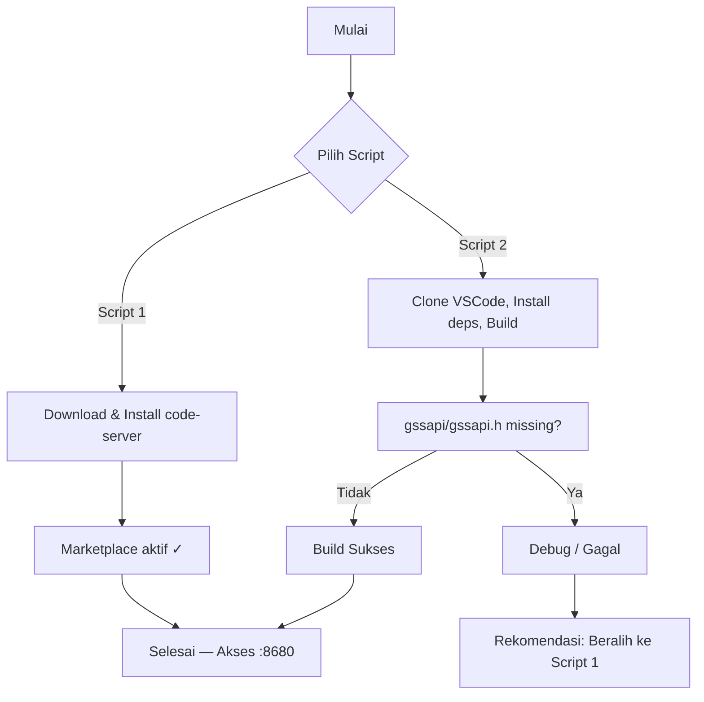

# 🚀 VSCode Server Deploy — Stabil, Cepat, Marketplace‑Ready

[](https://github.com/biezz-2/VS-Code-Server)
[](LICENSE)
[](#rekomendasi-akhir)

Deskripsi singkat:
Repositori ini menyediakan dua opsi pemasangan VS Code Server: satu metode yang direkomendasikan (menggunakan code-server dari Coder, cepat dan stabil), serta satu metode eksperimen (mencoba membangun versi web asli VS Code dari sumbernya — berisiko tinggi). Dokumen ini disusun secara formal namun bersahabat, dengan panduan praktis dan penjelasan yang dirancang untuk membantu Anda membuat keputusan yang tepat.

---

## 📌 Ringkasan Inti (Executive Summary)

- Rekomendasi utama: Script 1 — code-server (stabil, cepat, mendukung Microsoft Marketplace dan Copilot).
- Script 2 hanya untuk eksperimen; rawan kegagalan karena dependensi sistem yang kompleks.
- Cocok untuk instalasi di Proxmox LXC, VPS, atau mesin fisik.

---

## 🎯 Rekomendasi Akhir

Pilih Script 1 (code-server) apabila Anda mengutamakan:
- Kecepatan pemasangan
- Stabilitas jangka panjang
- Dukungan penuh untuk extension dari Microsoft Marketplace, termasuk GitHub Copilot

Hindari Script 2 kecuali Anda siap melakukan debugging mendetail terhadap dependensi sistem.

---

## 📥 Instalasi — Perintah One‑Click

Script 1 (RECOMMENDED — Code‑Server + Marketplace)
```sh
bash -c "$(curl -fsSL https://raw.githubusercontent.com/biezz-2/VS-Code-Server/refs/heads/main/unofficial-vscode-server.sh)"
# Akses setelah selesai: http://YOUR_IP:8680
```

Script 2 (Original VSCode Web Build — EXPERIMENTAL)
```sh
bash -c "$(curl -fsSL https://raw.githubusercontent.com/biezz-2/VS-Code-Server/refs/heads/main/official-vscode-server.sh)"
# Akses setelah selesai (jika berhasil): http://YOUR_IP:8680
```

---

## 📊 Ringkasan Hasil Uji Lapangan (Pool Analysis)

| Aspek              | Script 1 (Code‑Server) | Script 2 (Original Build)             |
| ------------------ | ---------------------- | ------------------------------------- |
| Success Rate       | ✅ 100%                 | ❌ 0% (3 kegagalan saat pengujian)     |
| Waktu Instalasi    | ⚡ ±5 menit             | ⏳ 2+ jam (sering memerlukan debugging)|
| Jumlah Error       | 0                      | 3+ (masih terhitung)                  |
| GitHub Copilot     | ✅ Berfungsi            | ❓ Gagal build                         |
| Marketplace        | ✅ Aktif                | ❓ Tidak pasti                         |
| Maintenance        | ✅ Mudah                | ❌ Rumit & rentan error               |
| Rekomendasi Akhir  | ⭐ Production Ready     | ⚠️ Tidak stabil                        |

---

## 🧭 Diagram Alur Instalasi



---

## 📁 Struktur Repositori

```
vscode-server-deploy/
├── unofficial-vscode-server.sh     # Script 1 (Direkomendasikan)
├── official-vscode-server.sh       # Script 2 (Eksperimental)
├── VSCODE-SERVER-README.md
├── README.md                       # (Dokumen ini)
└── LICENSE
```

---

## ⚙️ Rincian Teknis Singkat

Script 1 — Code‑Server:
- Menggunakan binary code-server (project Coder).
- Microsoft Marketplace dapat digunakan penuh.
- Proses: instalasi cepat → konfigurasi otomatis → pemasangan paket .deb kecil (~50 MB).
- Kelebihan: ringan, cepat, stabil.

Script 2 — VS Code Original Build:
- Mengunduh kode sumber VS Code; memasang Node.js/Yarn; mengunduh dependensi besar (~800 MB); membangun web version.
- Masalah umum: header native (mis. gssapi/gssapi.h) hilang, dependensi sistem tidak lengkap.
- Kelemahan: rumit, memakan waktu dan sumber daya, rawan kegagalan.

---

## 🔧 Manajemen Layanan (Systemd)

Untuk Script 1 (code-server):
```sh
systemctl start code-server@$USER
systemctl stop code-server@$USER
systemctl restart code-server@$USER
systemctl status code-server@$USER
journalctl -u code-server@$USER -f
```

Untuk Script 2 (jika terpasang):
```sh
systemctl start vscode-server
systemctl stop vscode-server
systemctl restart vscode-server
systemctl status vscode-server
```

---

## 🔐 Konfigurasi Keamanan (Password)

Lokasi konfigurasi (script 1):
```sh
nano ~/.config/code-server/config.yaml
```
Contoh pengaturan:
```yaml
auth: password
password: your_secure_password_here
```
Setelah mengedit:
```sh
systemctl restart code-server@$USER
```

---

## 🛠️ Troubleshooting Umum

- Service tidak berjalan:
  - systemctl status code-server@$USER
  - journalctl -u code-server@$USER -n 50
  - ss -tulpn | grep 8680

- Error `gssapi/gssapi.h` pada Script 2:
  - Tanda bahwa dependensi native hilang. Solusi memerlukan pemasangan paket development sistem (varies by distro) — namun secara praktis lebih cepat beralih ke Script 1.

- Extension tidak terpasang:
  - Pastikan konektivitas ke Marketplace; restart code-server; periksa log.

- Lupa password:
  - Ubah `auth` menjadi `none` sementara di config, atau set password baru lalu restart service.

---

## 🔁 Pembaruan & Changelog Singkat

Cara cepat memperbarui script:
```sh
curl -fsSL https://raw.githubusercontent.com/biezz-2/VS-Code-Server/refs/heads/main/unofficial-vscode-server.sh -o /tmp/unofficial-vscode-server.sh
bash /tmp/unofficial-vscode-server.sh --upgrade
```

Changelog (entri terbaru di atas):
- 2025-12-01 — Perbaikan integrasi Marketplace untuk code-server
- 2025-11-10 — Pembaruan template systemd
- 2025-10-05 — Perbaikan dokumentasi dan troubleshooting

---

## 📦 Fitur Utama

- Dukungan penuh Microsoft Marketplace (Script 1).
- GitHub Copilot kompatibel pada Script 1.
- Dapat diakses melalui jaringan lokal.
- Integrasi systemd untuk auto-start.

---

## 🤝 Kontribusi

Langkah kontribusi:
1. Fork repositori
2. Buat branch baru: git checkout -b feature/nama-fitur
3. Commit perubahan dan push
4. Buat Pull Request dengan uraian perubahan yang jelas

Sebelum membuka issue, sertakan informasi lingkungan (distro, versi kernel, output systemctl journal, dsb.) untuk mempercepat penanganan.

---

## 🧾 Lisensi

Proyek ini dilisensikan di bawah MIT License — bebas digunakan dan dimodifikasi. Lihat file LICENSE untuk detail.

---
